# Trabalho de Desenvolvimento Web (+ Projeto de Sistemas)
Repositório para atividades relativas ao projeto da disciplina de Desenvolvimento Web

## Objetivo
Criação de um aplicativo mobile para agendamento de horários com barbeiros, visando eliminar o tempo de espera para ser atentido por esses profissionais.

## Grupo:
David Vilaça (vilacapdavid@gmail.com)  
Douglas Inácio (douglasbravimbraga@hotmail.com)  
Ewerson Vieira (ewersonv@gmail.com)  
Luiz Henrique (luiz.lk.lima@gmail.com)  
Magno Macedo (magnomacedodeoliveira@gmail.com)  

## PMC

## Minimundo
Observando a constante presença de filas para atendimento em barbearias, pensamos na criação de um aplicativo que pudesse evitar esse problema, fazendo com que o processo fosse mais ágil para os clientes, eliminando a espera por atendimento e aliando formas de pagamento ao aplicativo, dando mais comodidade para aos usuários.

No aplicativo em questão os donos de barbearias realizam o cadastro de suas barbearias, bem como dos barbeiros que nela trabalham, e especificam o horário de funcionamento das mesmas, os serviços oferecidos (corte de cabelo, barba, etc) e o valor de cada tipo de serviço. Os barbeiros, por sua vez, cadastram sua jornada de trabalho (dias da semana em que trabalham e horário de entrada e saída de cada dia). O sistema então criará os horários disponíveis de acordo com a jornada de cada barbeiro. Por padrão, o sistema estipula 20 minutos de atendimento para cada agendamento. Os clientes realizam o cadastro no aplicativo informando seus dados pessoais e sua localização. Clientes podem buscar por barbearias, ver barbearias próximas a sua localização e agendar horários para serem atendidos.

Assim que um cliente realizar um agendamento, o barbeiro responsável por atendê-lo recebe uma notificação. O pagamento deve ser confirmado assim que o agendamento for feito. O cliente pode cancelar o agendamento até 1 hora antes do mesmo ocorrer. Neste caso, o sistema estorna 80% do valor para o cliente, torna o horário do barbeiro disponível novamente e o notifica.

Para o cliente é importante aparecerem barbearias próximas à sua localização, poder alterar o local onde se encontra, visualizar o barbeiro que o atenderá, bem como seus agendamentos passados e futuros. Já para os barbeiros, é importante poder alterar os horários de atendimento de acordo com sua jornada de trabalho, visualizar seus atendimentos e os respectivos clientes. Por fim, para o dono da barbearia é importante visualizar a quantidade de atendimentos realizados por cada um de seus funcionários, o tipo de serviço que foi prestado e poder gerenciar (adicionar/remover) barbeiros.

## Plataforma de Implementação:
### Qual a localização geográfica dos usuários?
Os usuários estão localizados no território nacional (Brasil), com foco no estado do Espírito Santo.

### Qual o ambiente de hardware e software? Há restrições?
O sistema será executado em dispositivos mobile, nos sistemas Android e iOS, com foco no Android.

### Qual a frequência de uso do sistema ou funcionalidade? E tempo de resposta esperada?
Espera-se um uso diário do sistema, com tempo de resposta de alguns segundos por operação

### Qual o volume de dados esperado? (inicial e futuramente)
Inicialmente estimamos um cadastro de 50 barbearias, com média de 2 barbeiros por barbearia, e cerca de 200 usuários.

### Há restrições de confiabilidade? (tempo entre falhas) Tarefas críticas, que envolvam risco ou de alto impacto no negócio?
Sobre as restrições de confiabilidade, se tratando de disponibilidade, dentre 1000 solicitações, o sistema deve atender 999 delas. A taxa de ocorrência de falhas deve ser de 5/1000. Além disso, temos como tarefa crítica pagamentos utilizando cartão de crédito, referentes aos agendamentos marcados pelos usuários.

### Há restrições de segurança? Dados confidenciais, por exemplo?
Usaremos hash para senhas e criptografia para dados de cartão de crédito no momento de armazenar essas informações no banco de dados

### Quais os perfis dos usuários? São leigos, experts, usuários frequentes, esporádicos? Possuem alguma dificuldade ou limitação?
Usuários leigos e esporádicos, acostumados ou não com o uso de aplicativos mobile.

### Há alguma previsão de mudanças futuras? Há alterações no negócio (tipo de produtos, etc)?
Uma das mudanças previstas será a inclusão de funcionalidades para atender ao público feminino, já que há diferenças em vários aspectos em relação ao escopo principal, como salões exclusivos, tipos de serviços oferecidos, etc.

## Requisitos Não Funcionais
| Identificador | Descrição | Categoria | Escopo |
|---------------|-----------|-----------|--------|
| RNF01 | O sistema deve ser construído utilizando uma linguagem de fácil manutenção. | Manutenibilidade | Sistema |
| RNF02 | O usuário deve ser capaz de utilizar as principais atividades do sistema em, no máximo, 2 minutos. | Inteligibilidade | Sistema |
| RNF03 | O sistema deve ser feito para Android e iOS. | Compatibilidade | Sistema |
| RNF04 | O sistema deve ter um meio de exibir a localização do estabelecimento num mapa. | Interoperabilidade | Sistema |
| RNF05 | O sistema deve autenticar seus usuários. | Autenticação | Sistema |
| RNF06 | As pesquisas dos usuários devem ser retornadas em menos de 10 segundos. | Operacionalidade | Funcionalidade |
| RNF07 | O sistema deve estar disponível 24h/dia. | Disponibilidade | Sistema |
| RNF08 | O sistema deve ter meios de resolver transações pendentes (segurança contra falhas). | Interoperabilidade | Sistema |
| RNF09 | Os módulos que compõem o sistema devem estar bem separados. | Modificabilidade | Sistema |
| RNF10 | O sistema precisa estar disponível para usuários de todo o país. | Operacionalidade | Sistema |
| RNF11 | O sistema deve dar um feedback claro à respeito dos erros que eventualmente ocorrerem. | Analisabilidade | Sistema |
| RNF12 | O sistema deve controlar o acesso dos usuários às rotas específicas de cada um deles. | Autorização | Sistema |
| RNF13 | O usuário deve ser avisado quando estiver realizando alguma ação crítica (agendamento/pagamento). | Proteção contra erros do usuário | Sistema |
| RNF14 | O acesso ao banco de dados deve ser feito de forma separada, possibilitando a utilização do mesmo banco em uma versão Web. | Reusabilidade | Sistema |

## Táticas
| Categoria | Requisitos Não Funcionais Considerados | Condutor da Arquitetura | Tática |
|-----------|----------------------------------------|-------------------------|--------|
| Manutenibilidade | RNF01 | Sim | Implementar a solução em JavaScript. |
| Inteligibilidade | RNF02 | Não | Utilizar heurísticas de nielsen. |
| Compatibilidade | RNF03 | Sim | Utilizar React Native. |
| Interoperabilidade | RNF04, RNF08 | Não | <li> Utilizar API de geolocalização do Google. </li>  <li> Usar API externa para pagamentos. </li> |
| Autenticação | RNF05 | Não | Autenticar o usuário através de e-mail e senha ou login via rede social. |
| Operacionalidade | RNF06, RNF10 | Sim | <li> Utilizar cache para as ações do usuário. </li>   <li> Utilizar Docker para escalar a aplicação. </li> |
| Disponibilidade | RNF07 | Sim | Utilizar arquitetura escalável e distribuir os servidores. |
| Modificabilidade | RNF09 | Sim | Utilizar arquitetura MVC. |
| Analisabilidade | RNF11 | Não | Utilizar Sentry para reportar log completo a respeito dos erros. |
| Autorização | RNF12 | Não | Separar o acesso às funcionalidades por tipo de login (cliente/barbeiro). |
| Proteção contra erros do usuário | RNF13 | Não | Solicitar confirmações do usuário diante de tarefas críticas. |
| Reusabilidade | RNF14 | Sim | O <i>backend</i> da aplicação deve ser feito utilizando o conceito de API REST. |

## Protótipos das Telas

### 1. Tela de Login  

    

### 2. Tela Lista de Barbeiros  

    

### 3. Tela Cortes Agendados  

    

O protótipo completo pode ser visto [aqui](arquivos/Barbex.pdf).

## Diagrama de classes

## Diagrama de sequência

## Back-end
O back-end da aplicação se encontra [neste repositório](https://github.com/v1eira/barbex-backend).