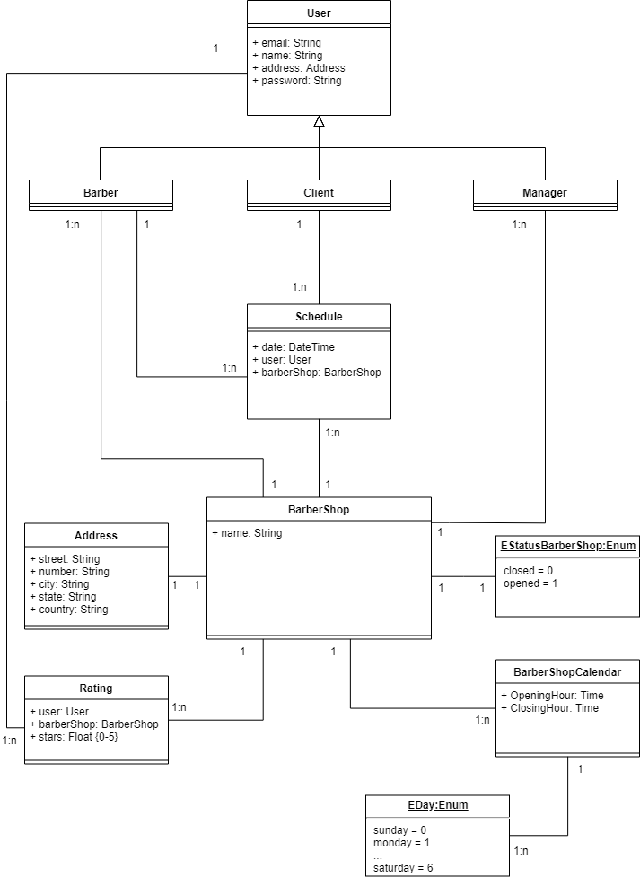

# Trabalho de Desenvolvimento Web (+ Projeto de Sistemas)
Repositório para atividades relativas ao projeto da disciplina de Desenvolvimento Web

# Objetivo
Criação de um aplicativo mobile para agendamento de horários com barbeiros, visando eliminar o tempo de espera para ser atentido por esses profissionais.

# Grupo:
David Vilaça (vilacapdavid@gmail.com)  
Douglas Inácio (douglasbravimbraga@hotmail.com)  
Ewerson Vieira (ewersonv@gmail.com)  
Luiz Henrique (luiz.lk.lima@gmail.com)  
Magno Macedo (magnomacedodeoliveira@gmail.com)  

# PMC

# Minimundo
Observando a constante presença de filas para atendimento em barbearias, pensamos na criação de um aplicativo que pudesse evitar esse problema, fazendo com que o processo fosse mais ágil para os clientes, eliminando a espera por atendimento e aliando formas de pagamento ao aplicativo, dando mais comodidade para o cliente.

No aplicativo em questão os donos de barbearias realizam o cadastro de suas barbearias, bem como dos barbeiros que nela trabalham, e especificam o horário de funcionamento das mesmas e o valor de cada tipo de atendimento (corte de cabelo, barba, etc). Os barbeiros, por sua vez, cadastram seus horários de atendimento. Por padrão, o sistema estipula 20 minutos de atendimento para cada cliente. Os clientes realizam o cadastro no aplicativo informando seus dados pessoais e sua localização. Clientes podem buscar por barbearias, ver barbearias próximas a sua localização e agendar horários para serem atendidos.

Assim que um cliente realizar um agendamento, o barbeiro responsável por atendê-lo recebe uma notificação. O pagamento deve ser confirmado assim que o agendamento for feito. O cliente pode cancelar o agendamento até 1 hora antes do mesmo ocorrer. Neste caso, o sistema estorna 80% do valor para o cliente, torna o horário do barbeiro disponível novamente e o notifica.

Para o cliente é importante aparecerem barbearias próximas à sua localização, poder alterar o local onde se encontra, visualizar o barbeiro que o atenderá bem como seus agendamentos passados e futuros. Já para os barbeiros, é importante poder alterar os horários de atendimento de acordo com sua jornada de trabalho, visualizar seus atendimentos e os respectivos clientes.

# Requisitos Não Funcionais + Táticas
| RNF | Detalhamento | Tática |
|---|---|---|
| RNF01 | O sistema deve ser construído utilizando uma linguagem de fácil manutenção. | Implementar a solução em JavaScript. |
| RNF02 | A interface do sistema deve ser responsiva. | Utilizar bootstrap. |
| RNF03 | O sistema deve ser feito para Android e iOS. | Utilizar React Native. |
| RNF04 | O sistema deve ter um meio de exibir a localização do estabelecimento num mapa. | Utilizar geolocalização. |
| RNF05 | O sistema deve autenticar seus usuários. | Autenticar o usuário através de e-mail e senha ou login via rede social. |
| RNF06 | O sistema deve retornar a pesquisa do usuário em menos de 10 segundos. | Utilizar cache para as ações do usuário. |
| RNF07 | O sistema deve ter alta disponibilidade. | Utilizar arquitetura escalável e distribuir os servidores. |
| RNF08 | O sistema deve ter meios de resolver transações pendentes (segurança contra falhas). | Usar API externa para pagamentos. |
| RNF09 | O usuário deve ser capaz de utilizar as principais atividades do sistema em, no máximo, 2 minutos. | Utilizar heurísticas de nielsen. |
| RNF10 | O sistema deve ser modularizado. | Utilizar arquitetura MVC. |
| RNF11 | O sistema precisa estar disponível para usuários de todo o país. | Utilizar Docker para escalar a aplicação. |

# Protótipos das Telas

## 1. Tela de Login  

    

## 2. Tela Lista de Barbeiros  

    

## 3. Tela Cortes Agendados  

    

O protótipo completo pode ser visto [aqui](arquivos/Barbex.pdf).

## Diagrama de classes
